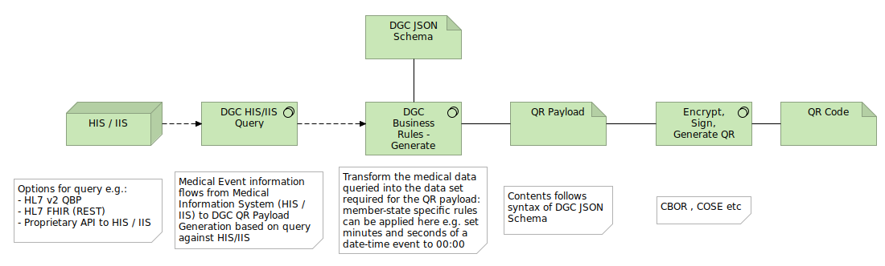

#  EU Digital Green Certificate JSON Schema FAQ

## What are the certificate types supported?

As per the [EU legislation](https://eur-lex.europa.eu/legal-content/EN/TXT/?uri=CELEX:52021PC0130), the three certificate types are:

  - Vaccination
  - Test
  - Recovery

## What do the typical processing stages look like for:

### Issuance of QR

### Verification of QR

In both these cases there is a stage of processing in software in which business rules are applied.  Examples of actions you that may be present in business rules:

#### Issuance

- If a required portion of a name is missing from the original data, set it to an empty value (see also: [Mandatory Fields and Missing Data](#mandatory_but_missing))
- If an [ISO8601](https://www.iso.org/iso-8601-date-and-time-format.html) date-time field is specified as mandatory in the DGC JSON schema but do not wish to include the time portion as a matter of policy  for your Member State, then you can set the hours, minutes and seconds (hh:mm:ss) fields to 00:00:00
- In generating the certificate id, the choice of which option to choose from Annex 2 in the [eHealthNetwork Vaccination Interoperability Guidelines](https://ec.europa.eu/health/sites/health/files/ehealth/docs/vaccination-proof_interoperability-guidelines_en.pdf) is delegated to a member state. The business rules for issuance is an ideal place to create such a certificate id as per Member State policy.

#### Verification

- If the QR payload you are reading contains a value unknown to you in a field governed by a defined ValueSet type, then you may choose whether you wish to validate the QR payload or not. An example of this is if there is a newer vaccine type available than is known to the verifier application. Assuming, the issuing state is using a known, valid vaccine type, then it can well be the case that the Verifier application is referring to a somewhat out-dated version of the ValueSet for vaccine types. One possible action at this point as a Verifier application could be to ensure that the latest ValueSet values are available to it and to re-try validation.

- Process fields to arrive at a concrete payload. An example of this is to pass the certificate_id field in full (see [UVCI Format](#uvci_format)) to a name resolution service which will map this to a resource that can be used for further processing, according to the Member State name resolution rules.

## Reconciliation of Mandatory Fields and Missing Data

It can be the case that the data required to populate the DGC JSON schema is simply not present in the  source data when queried. An oft-encountered example of this is with the patient name, where often the Family Name (EU Regulations: "Surname") is present, but the Given Name (EU Regulations: "Forename") is not. In the Annex to the proposed  [EU legislation](https://eur-lex.europa.eu/legal-content/EN/TXT/?uri=CELEX:52021PC0130) it is stated that Surname(s), Forename(s) shall be given, in that order. In order to make the DGC JSON Schema  as conformant as possible to this legislation, both fields Family Name and Given Name are marked as `["required"]` so we need to supply the values.  However, our data source only has Family Name and not Given Name. 

The solution is to use the [DICOM](https://www.dicomstandard.org/) approach of 
[Type 2](http://dicom.nema.org/medical/dicom/current/output/html/part05.html#sect_7.4.3) values. In summary, this  allows a value to be specified as mandatory but can be marked as being empty and have no value. The rich [DICOM](https://www.dicomstandard.org/) metadata approach to values is not available to us in JSON (although we could  get very close using XML), but we can approximate the [DICOM](https://www.dicomstandard.org/) approach by setting the mandatory field to an empty value (i.e. empty string for string types, 0 for numeric types). In this way, we can both support a mandatory value but allow the flexibility of handling the case when the source data simply does not 
have the value available for us. 

Please note that if the value is available, then it is required to be set, as per  [DICOM Type 2](http://dicom.nema.org/medical/dicom/current/output/html/part05.html#sect_7.4.3):

> [... defines] Type 2 Data Elements that shall be included and are mandatory Data Elements. However, it is permissible 
> that if a Value for a Type 2 element is unknown it can be encoded with zero Value Length and no Value. 
> **If the Value is known the Value Field shall contain that value [...]. 
> These Data Elements shall be included in the Data Set and their absence is a protocol violation.**

## Annex 2 specifies three different formats for certificate id (UVCI). Which one do I use?

For _generating_ the certificate id: the choice of which option to choose from Annex 2 in the  [eHealthNetwork Vaccination Interoperability Guidelines](https://ec.europa.eu/health/sites/health/files/ehealth/docs/vaccination-proof_interoperability-guidelines_en.pdf) is delegated to the Member State.

For _verifying_ the certificate id: the complete certificate id field is simply passed to a standard (arpa) name  resolution mechanism. Annex 2 also states that it is the responsibility of each Member State to maintain its own valid name resolution mapping:

> [...]  the Country or Authority identifier is well-managed; and each country
> (authority) is expected to manage its segment of the namespace well by never
> recycling or re-issuing identifiers. 

## Why does the DGC Schema does not conform precisely to the EU legislation in manner "X"?

The DGC Schema supports conformity to the proposed [EU legislation](https://eur-lex.europa.eu/legal-content/EN/TXT/?uri=CELEX:52021PC0130) is intended to be a vehicle for serialization and de-serialization according to several differing Member State requirements.  For example, one Member State wishes to generate one QR code per [certificate type](#cert_types) and another may wish to generate a QR code combining two or three types of certificate. Both of these scenarios are supported by the DGC Schema. The business rules for that Member State, however, determine precisely which data the DGC schema will be populated with.

## Why are the certificate type entries specified as an array?

The DGC schema presented here allows for multiple of all entries (in essence: array of <type>). This is because, the DGC schema (1) is designed in such a way that if regulations require (or allow) more than one entry per type,  then there is no fundamental schema structure change, and (2) that the current regulation-conform implementation of only one entry can just be considered as an array of one element.

The proposed [EU legislation](https://eur-lex.europa.eu/legal-content/EN/TXT/?uri=CELEX:52021PC0130) specifies in the  Annex which fields shall be present for a given instance of a particular [certificate type](#cert_types). It must  therefore be possible to create a QR payload (the DGC schema) with this information foR
 
The current schema allows us to conform to EU regulation, so that's the main criteria. It also allows for extension if / when needed (the Open-Closed Principle of "open for extension, closed for modification") - the 'O' in  [SOLID](https://en.wikipedia.org/wiki/SOLID). The absolute final say on what is valid for (i) the EU and (ii) a  given member state can be applied in the business rules part of the processing.
