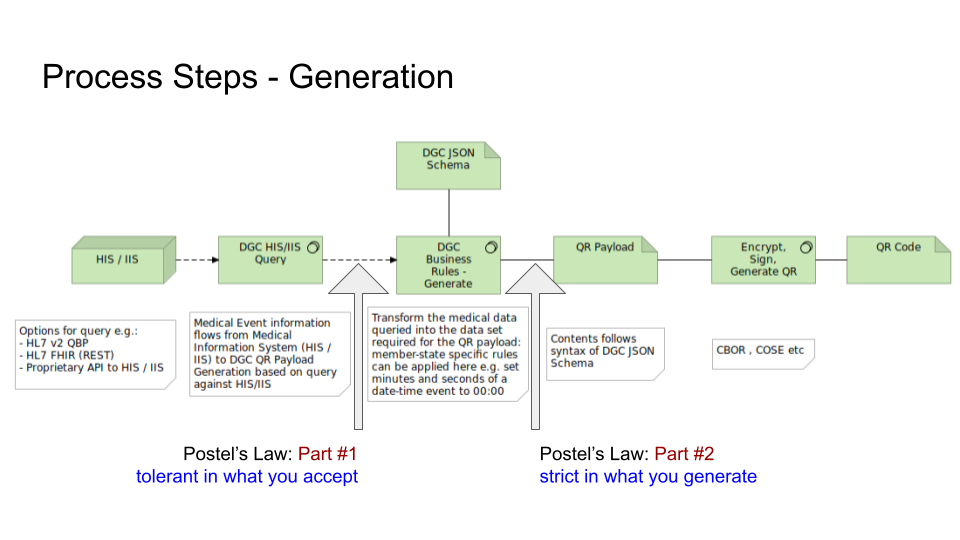
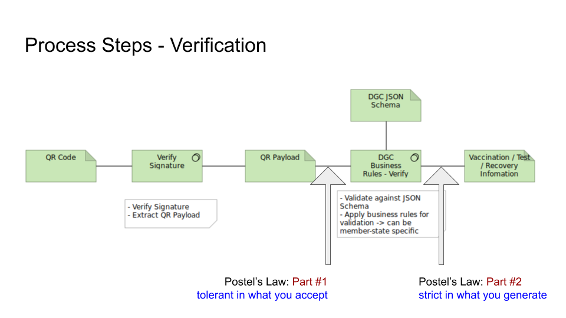

#  EU Digital Covid Certificate JSON Schema FAQ

## <a id="cert_types"></a>What are the certificate types supported?

As per the [EU legislation](https://eur-lex.europa.eu/legal-content/EN/TXT/?uri=CELEX:52021PC0130), the three certificate types are:

  - Vaccination
  - Test
  - Recovery

## What do the typical processing stages look like for:

### Up-Front: Postel's Law

A phrasing of Postel's law I have found useful is: "Tolerant with what you accept, strict in what you generate"

### Issuance of QR

Postel's Law for Issuance: 

### Verification of QR

Postel's Law for Verification: 

In both these cases there is a stage of processing in software in which business rules are applied. Examples of actions that may be present in business rules:

#### Issuance

- If a required portion of a name is missing from the original data, set it to an empty value (see also: [Mandatory Fields and Missing Data](#mandatory_but_missing))
- If an [ISO8601](https://www.iso.org/iso-8601-date-and-time-format.html) date-time field is specified as mandatory in the DCC JSON schema but you do not wish to include the time portion as a matter of policy for your Member State, then you can set the hours, minutes and seconds (hh:mm:ss) fields to 00:00:00
- In generating the certificate id, the choice of which option to choose from Annex 2 in the [eHealthNetwork Vaccination Interoperability Guidelines](https://ec.europa.eu/health/sites/health/files/ehealth/docs/vaccination-proof_interoperability-guidelines_en.pdf) is delegated to a Member State. The business rules for issuance is an ideal place to create such a certificate id as per Member State policy.

#### Verification

- If the QR payload you are reading contains a value unknown to you in a field governed by a defined ValueSet type, then you may choose whether you wish to validate the QR payload or not. An example of this is if there is a newer vaccine type available than is known to the verifier application. Assuming the issuing state is using a known, valid vaccine type then it can well be the case that the Verifier application is referring to a somewhat out-dated local version of the ValueSet for vaccine types. One possible action at this point as a Verifier application could be to ensure that the latest ValueSet values are available to it (e.g. download latest) and to re-try validation.

- Process fields to arrive at a concrete payload. An example of this is to pass the ```certificate id``` field in full (see [UVCI Format](#uvci_format)) to a name resolution service (arpa) which will map this to a resource according to the Member State name resolution rules. This resolved resource can in turn be used for further processing.

## Applying Postel's Law

First of all, let's consider the extreme case:

* strict in what you generate: - issue in full conformance to all business rules (highest priority) and then to the DCC physical structure (schema). Since Issuance business rules may vary by Member State then the underlying schema needs to be flexible enough to accomodate them all.

* tolerant in what you accept: in the extreme case, no schema validation at all, all validation by your own verification business rules and no schema validation at all - after all, the schema defines "only" the physical payload structure

Issues with this extreme scenario:

* Issuance - none, provided the schema stucture is flexible enough to accomodate the varying issuance rules
* Schema structure - note that I still talk about structure and not some amorphous blob - Postel's Law doesn't say "accept any old input" it says " be tolerant in what you accept" which is not the same thing at all. I'll come back to this point.
* Verification - if you don't use schema validation then there will be lots of boiler plate checks in code that could easily be handled by schema validation. The mistake here would be to apply schema validation and immediately reject the payload.

Now applying Postel's Law:

* Issuance : clear - business rules primary spec, physical structure of schema secondary
* Verification - physical structure of schema allows some basic checks to be automated and avoid a lot of development time and potential errors in implementation
* Schema - some physical structure in the schema (1) helps prevent the amorphous blob syndrome, and (2) aids verifiers to perform routine "bulk" checks on the payload before applying business rules.

So let's take a small example: I generate my QR payload with a date-time field e.g. for a test certificate I specify date-time of sample collection (t/sc) which is given in the v1.3.0 spec as e.g. YYYY-MM-DDThh:mm:ssZ. However, I generate with more precision than is specifed (you could argue this is a violation of Postel's Law, or you could argue that it is not - you are being very specific with what you generate) YYYY-MM-DDThh:mm:ss.sssZ.

Applying a very strict schema here on the verification side would cause this to fail, which is perhaps not an altogether unreasonable option * provided * you don't immediately fail the payload. You see, the information that you require (YYYY-MM-DDThh:mm:ss) is actually present as a subset of the complete value. So what you could do is try validation, let it fail * but then * handle the schema validation error(s) and see if there is something you can rescue - here the case would be you can definitely "rescue" the original required information to the specified resolution and so you can continue with the verification process.

Where having some schema structure and some typing of entries comes in useful is to easily catch "obvious" errors like someone putting "abcde" in a date field (e.g. hacker trying to look for weaknesses in the system). This too would fail the standard schema validation check then your code to handle this failed schema check can take a look at the value and see if you can generate a date out of the data. With "abcde" no you can't so this would fail verification.

Similar case actually for a string without the CBOR string tag: it may fail initial validation, but you try to see if you can make something sensible out of the contents anyway. If so, then continue. If not, then fail.

A third and final rather topical example: supposing you were verifying with v 1.0.x of the schema, and someone sends you a partial date with e.g. v1.2.x of the schema. This will fail initial schema validation. So you handle the error case and take a look at what you have. Well, you have just the year. Do your business rules allow just a year here? If so, then take the partial date and continue. If not, then you can reject as invalid -> but only after you have a first schema validation error and then seeing if you can use whatever is in the field anyway, according to your verification business rules.

Out of all of the above:

* you can hopefully see that it makes sense to have the same schema for issuance as for verification - * provided * that you implement the verification as per Postel's Law.
* that issuance and verification rules necessarily have to have precedence over the schema.

## <a id="mandatory_but_missing"></a>Reconciliation of Mandatory Fields and Missing Data

It can be the case that the data required to populate the DCC JSON schema is simply not present in the  source data when queried. An oft-encountered example of this is with the patient name, where often the Family Name (EU Regulations: "Surname") is present, but the Given Name (EU Regulations: "Forename") is not. In the Annex to the proposed [EU legislation](https://eur-lex.europa.eu/legal-content/EN/TXT/?uri=CELEX:52021PC0130) it is stated that "_Surname(s), Forename(s) shall be given, in that order_". In order to make the DGC JSON Schema  as conformant as possible to this legislation, both fields Family Name and Given Name can be marked as `["required"]` in the JSON schema so we need to supply the values. However, our data source only has Family Name and not Given Name.

One solution is to use the [DICOM](https://www.dicomstandard.org/) approach of
[Type 2](http://dicom.nema.org/medical/dicom/current/output/html/part05.html#sect_7.4.3) values. In summary, this  allows a value to be specified as mandatory but can be marked as being empty and have no value. The rich [DICOM](https://www.dicomstandard.org/) metadata approach to values is not available to us in JSON (although we could  get very close using XML), but we can approximate the [DICOM](https://www.dicomstandard.org/) approach by setting the mandatory field to an empty value (i.e. empty string for string types, 0 for integer types, 0.0 for floating-point types etc). In this way, we can support both a mandatory value but allow the flexibility of handling the case when the source data simply does not have that mandatory value available for us.

Please note that if the value is available, then it is required to be set, as per [DICOM Type 2](http://dicom.nema.org/medical/dicom/current/output/html/part05.html#sect_7.4.3):

> [... defines] Type 2 Data Elements that shall be included and are mandatory Data Elements. However, it is permissible
> that if a Value for a Type 2 element is unknown it can be encoded with zero Value Length and no Value.
> **If the Value is known the Value Field shall contain that value [...].
> These Data Elements shall be included in the Data Set and their absence is a protocol violation.**

Please also note that "if the value is available" will cover an often seen although incorrect usage of the person name which is to supply only the Family Name (and leave the Given Name field empty). However, the Family Name field will contain both Family and Given names in the one field separated by, typically, a '^' character e.g. "Surname^Given". This is seen, for example, when DICOM metadata information is (incorrectly) simply copied "blind" to the corresponding HL7 data field. In this case, the Given Name value **is** present, even if the Given Name field is empty. It is the responsibility of the Issuance business rules to ensure that the Given Name value is populated if it is present in the source data - including it being "hidden" in the string for Family Name.

## <a id="uvci_format"></a>Annex 2 specifies three different formats for certificate id (UVCI). Which one do I use?

For _generating_ the certificate id: the choice of which option to choose from Annex 2 in the [eHealthNetwork Vaccination Interoperability Guidelines](https://ec.europa.eu/health/sites/health/files/ehealth/docs/vaccination-proof_interoperability-guidelines_en.pdf) is delegated to the Member State.

For _verifying_ the certificate id: the complete certificate id field is simply passed to a standard (arpa) name resolution mechanism. Annex 2 also states that it is the responsibility of each Member State to maintain its own valid name resolution mapping:

> [...]  the Country or Authority identifier is well-managed; and each country
> (authority) is expected to manage its segment of the namespace well by never
> recycling or re-issuing identifiers.

## Why does the DCC Schema not contain my gender, titles, suffixes, race?

The DCC Schema design process followed the principles of [Privacy By Design](https://www.esat.kuleuven.be/cosic/publications/article-1542.pdf). When the concept of data minimisation was applied to the identity section of the DCC the following datums were considered and rejected as the resulting cost to privacy is not proportional any perceived systemic benefits.

* Gender
* Titles (including common, professional, formal, academic)
* Suffixes
* Race

## Why does the DCC Schema not conform precisely to the EU legislation in manner "X"?

The DCC Schema supports conformity to the proposed [EU legislation](https://eur-lex.europa.eu/legal-content/EN/TXT/?uri=CELEX:52021PC0130) and is intended to be a vehicle for serialization and de-serialization according to several differing Member State requirements.  For example, one Member State wishes to generate one QR code per [certificate type](#cert_types) and another may wish to generate a QR code combining two or three types of certificate. Both of these scenarios are supported by the DCC Schema. The business rules for that Member State, however, determine precisely which data the DCC schema will be populated with at the time of generation.

## Why are the certificate type entries specified as an array?

The DCC schema presented here allows for multiple of all entries (in essence: array of <type>).

This is because the DCC schema:
1. is designed in such a way that if regulations require (or allow) more than one entry per type, then there is no fundamental schema structure change, and 
1. that the current regulation-conform implementation of only one entry can just be considered as an array of one element.

The proposed [EU legislation](https://eur-lex.europa.eu/legal-content/EN/TXT/?uri=CELEX:52021PC0130) specifies in the Annex which fields shall be present for a given instance of a particular [certificate type](#cert_types). It must therefore be possible to create a QR payload (the DCC schema) with this information.

The current schema allows us to conform to EU regulation, which is the main criteria. It also allows for extension if / when needed (the Open-Closed Principle of "open for extension, closed for modification") - the 'O' in  [SOLID](https://en.wikipedia.org/wiki/SOLID). The absolute final say on what is valid for (i) the EU and (ii) a given member state can be applied in the business rules part of the processing.

## UVCI checksum

The UVCI checksum algorithm used is Luhn-Mod-N.

For ease of reference, the following is taken directly from Annex 2 in the 
[eHealthNetwork Vaccination Interop Guidelines](https://ec.europa.eu/health/sites/health/files/ehealth/docs/vaccination-proof_interoperability-guidelines_en.pdf)

> 1. Charset: Only uppercase US-ASCII alpha numerical characters (`A` to `Z`, `0` to `9`)
> are allowed; with additional special characters for separation from [RFC3986](https://tools.ietf.org/html/rfc3986)
> , namely {`/`, `#`, `:`};
> 1. Maximum length: designers should try to aim for a length of 27-30 characters
> 1. Version prefix: This refers to the version of the UVCI schema. The version prefix is `01` for this version of the document. The version > prefix is composed of two digits.
> 1. Country prefix: The country code is specified by ISO 3166-1 alpha-2. Longer codes (e.g. 3 characters and up (e.g `UNHCR`) are reserved > for future use
> 1. Code suffix / Checksum:
>   1. Member States should use a checksum when it is likely that transmission,
> (human) transcription or other corruptions may occur (i.e. when used in print).
>   1. The checksum must not be relied upon for validating the certificate and is not technically part of the identifier but is used to 
> verify the integrity of the code. This checksum should be the ISO-7812-1 (LUHN-10)7 summary of the entire UVCI in digital/wire transport 
> format.  The checksum is separated from the rest of the UVCI by a `#` character.

### <a id="lmn-char-set"></a>Luhn-Mod-N charset

`ABCDEFGHIJKLMNOPQRSTUVWXYZ0123456789/:`

#### Use of separator markers in a UVCI

* `:` - is the field separator (HL7: `|`)
* `/` - separates components within a field (HL7: `^`)
* `#` - separate the Luhn-Mod-N checksum from the actual message 

Note that '#' is removed from the valid charset since it shall occur only as a separator for the Luhn-Mod-N checksum and is not part of the actual message.

### Prefix

The prefix "URN:UVCI:" shall be used for Vaccination, Test and Recovery certificate ids.

This prefix shall be included in the checksum calculation.

### Example

`URN:UVCI:01:NL:187/37512422923` using the [charset above](#lmn_char_set) gives the corresponding checksum character `Z`.

Note that as per Annex 2, it is required to separate the Luhn-Mod-N checksum from the data via a '#' separator, thus the final field inclusive of checksum character becomes: `URN:UVCI:01:NL:187/37512422923#Z`

### Reference Implementation

A reference implemenation in Python is available in https://github.com/ehn-digital-green-development/ehn-dgc-schema , in the directory `examples/Luhn-Mod-N`. 

The implementation is based on the original wikipedia article https://en.wikipedia.org/wiki/Luhn_mod_N_algorithm .


## Why not use "seconds since epoch" instead of the ISO 8601 format for  date and date-time?

1. Although the [proposed EU legislation]() does **not mandate** the use of ISO8601 for date / date-time, the informative document 
those regulations reference as supporting material, the [eHealthNetwork Vaccination Interop Guidelines](https://ec.europa.eu/health/sites/health/files/ehealth/docs/vaccination-proof_interoperability-guidelines_en.pdf), in Annex 2 clearly 
does state that the ISO8601 format shall be used. Thus whilst technically not legally mandated, it is, however, very much the intention that ISO8601 is used. Using "seconds since epoch" violates this recommendation.
1. Even if it were not the case that ISO8601 was recommended, using "seconds since epoch" is not portable across platforms: in particular Windows and *nix (e.g. Linux, Unix) operating systems have a different epoch start time (see also e.g. [Convert between Windows and Unix epoch](https://www.powershelladmin.com/wiki/Convert_between_Windows_and_Unix_epoch_with_Python_and_Perl) ). Thus using "seconds since epoch" is poor from an interoperability perspective.
1. The usual motivation for requesting "seconds since epoch" is ostensibly to "save space" (particularly with respect to generating a QR payload with only a limited number of bytes available). On closer inspection, it becomes rather debatable whether "seconds since epoch" offers any space saving. If you consider that the payload will be passed through some form of LZMA compression then any repeated (sub-)strings will be compressed into just one string occurence. For example, if the events all happened in the same year and in the same month, then the ISO8601 "YYYY-MM" field will occur once only in the compressed output. You can, of course, make similar arguments for at least parts of the "seconds since epoch" string, but at this point either format becomes very similar in terms of compression. You may save one character here or there - or maybe not, depending on the actual date / date-time involved and how often it repeats (or parts thereof) - by choosing one format over the other. This comes down to potentially one or two bytes (or not) depending on whichever representation you choose. This variance in byte length is insignificant (whichever format you choose) when you consider that the byte length of a person name field can easily vary by an order of magnitude greater than what you may (or may not) have saved in byte length by choosing either ISO8601 or "seconds since epoch". Thus the argument for *potentially* saving space in the QR payload by using "seconds since epoch" as opposed to ISO8601 is negligible (or even zero) <sup>[1](#footnote1)</sup> .


## Valuesets

### What's the function of the "active" flag in the valuesets and why don't you use it?

The function of the active flag is to cater for `valid from` and `valid until` dates for a given manufacturer / product.

The EU JRC currently does not provide `valid from` or `valid until` dates at the moment but are planning to do so. Currently, the EU JRC list is just a current version snapshot and by definition anything in that list is valid and anything not in that list is not valid. Once the EU JRC start generating their lists with `valid from` and `valid until` then we will start setting this value depending on those dates. For now, if an item is in the EU JRC list then it is by definition considered valid and thus the active flag is set to `true`.

#### valid until

Over time and certainly to ensure forward-compatibility, items in the EU JRC list will no longer be removed but will be marked as no longer valid by specifying a `valid until` date. Once that date has been exceeded the item is no longer valid but will still remain present in the list to avoid breaking earlier versions of datasets that may have referenced the item. The item can still be referenced but is simply no longer valid.

#### valid from

This can be used to already add a new manufacturer / product to the list before it becomes officially valid at the `valid from` date.

#### active flag

Given that it is intended to auto-generate the list once every 24 hours, the active flag will simply convert the `valid from` and `valid until` dates in the original EU JRC list to a boolean. It becomes a simple matter then for a user of the valueset to see if the entry is  active by looking at the active flag (active is true if at the date of generation the date lies between `valid from` and `valid until` dates). By generating an active flag we remove any local - even if temporary - errors that may be associated with timezone differences from the EU JRC list and since it is an operation that everyone would need to perform we may as well perform it once automatically at point of generation of the valueset as a service to all.

### How will valuesets be versioned? Globally vs on valueset level (-> valueSetDate = version?) vs  on entry level?

I already raised this one last week with the Semantic Sub-Group: my proposal for version was ISO8601 date-time to a resolution of 1 second at point of generation. However, ultimately the question of version management for valuesets is for the eHealthNetwork Semantic Sub-Group to decide. Discussion already active on this point. I will update as soon as I have a clear statement from them.

### Will there be one official API Endpoint to get updated valueset data?

Yes, absolutely. This will most likely be the DCCG central gateway and I have already discussed this with T-Systems. I am currently providing the valuesets here in this github repo as a courtesy so at least you have something to work from. This github repo is not really the place to store such valuesets for a production system. 

## Schema Location
"I get a 404 when trying to download the Schema from the URI."

The JSON schema specifies a URI not a URL:
http://json-schema.org/draft/2020-12/json-schema-core.html#rfc.section.8.2.1

> Note that this URI is an identifier and not necessarily a network locator. In the case of a network-addressable URL, a schema need not be downloadable from its canonical URI.


* A URI does not need to resolve to a physical resource, it is a logical address.
* A URL shall resolve to a physical resource, you should be able to access whatever is at that endpoint.
* JSON Schema (just like e.g. XSD etc) specifies a URI, not a URL
* That said, we do try to make these available under id.uvci.eu so people can develop / test against them without (necessarily) having to download them, but this not mandated by the JSON Schema.


## CBOR Encoding

Concise Binary Object Representation (CBOR), specified in [RFC7049](https://tools.ietf.org/html/rfc7049), defines a number of major data types. The following types are REQUIRED to be used by parties creating electronic health certificates payloads:

- Integers are encoded as CBOR major type 0, an unsigned integer.
- Strings are encoded as CBOR major type 3, a text string.
- Arrays are encoded as CBOR major type 4, an array of data items.
- Objects are encoded as CBOR major type 5, a map of pairs of data items.

Timestamps (defined by JSON type `string` and format `date-time`) MUST be encoded as CBOR major type 3, a text string, formatted per [RFC 3339, section 5.6](https://datatracker.ietf.org/doc/html/rfc3339#section-5.6), and SHOULD be tagged 0 as specified by [RFC 8949, section 3.4.1](https://datatracker.ietf.org/doc/html/rfc8949#section-3.4.1).

Validators MUST be able to read both tagged and untagged data.


## Name Transliteration and Truncation

Note that the DCC supports the ICAO transliterated form of a person's name according to the ICAO 9303 standard. The person name fields `fnt` and `gnt` - so those ending in 't' - are for the transliterated form of the native UTF-8 form of the name given in the corresponding fields `fn` and `gn`. The name may also need to be truncated according to ICAO 9303. [Part 3](https://www.icao.int/publications/Documents/9303_p3_cons_en.pdf) (pg 19) states:

> Examples of truncation of names are contained in the form factor specific Parts 4 to 7 of Doc 9303.

and e.g. [Part 4](https://www.icao.int/publications/Documents/9303_p4_cons_en.pdf) describes the Visual Inspection Zone (VIZ) data elements in 4.1.1.1 and specifically name truncation for the Machine Readable Zone (MRZ) in section 4.2.2.1

## Country Code and Issuer

* v / co - country of vaccination, in general ISO-3166 alpha-2 (with a couple of allowed exceptions)
* v / is - issuer - free text field, typically would be a member state Ministry of Health (or equivalent), but no constraints as such - is a free text field

* Country for issuer e.g. *Ministry of Health, Cyprus* as opposed to, say, *Ministry of Health, Italy*. This could be placed (maybe using ISO-3611-1 alpha-2 country code) directly in the "v / is" fre-text  field but of course this is still free-form as it is "simply" a string of free text.

Note that country issuing the certificate is already known in the CWT (signer), so this is another option - and a guaranteed one, too. 
Thus there is no need for an additional (duplicate) field in the DCC Schema to carry the information of Country of Issuer.

<hr/>

**Footnotes**

<a id="footnote1">1</a>. Although for ease of illustration I refer to LZMA compression of the original JSON source, the argument is transitively applicable to any stage of processing at which LZMA compression of the input data takes place, whether that input data is e.g. raw JSON or serialized CBOR etc. The achievable compression ratio for LZMA compression is, as ever, a function of the input data.
